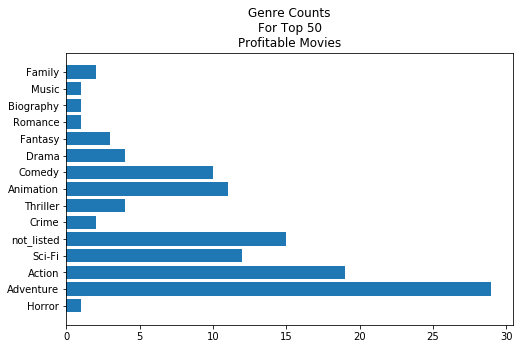

# Data Science - The Story of a Hollywood Hero


[Information on creating hyperlinks in jupyter found here](https://sebastianraschka.com/Articles/2014_ipython_internal_links.html) 

Adding anchors will make hyperlinking waaaayyy easier

convert notebook using the following command

`jupyter nbconvert --to markdown notebookname.ipynb`


### Outline
* [Goals and Overview](##goals-and-overview)
* [Final Thoughts](#final)

## Goals and Overview

In this project, I was given multiple datasets
* /zippedData/tmdb.movies.csv
* /zippedData/imdb.title.crew.csv
* /zippedData/tn.movie_budgets.csv
* /zippedData/imdb.title.ratings.csv
* /zippedData/imdb.name.basics.csv
* /zippedData/imdb.title.principals.csv
* /zippedData/imdb.title.akas.csv
* /zippedData/bom.movie_gross.csv
* /zippedData/imdb.title.basics.csv

The goal of this project is to find at least 5 insights in this data by joining tables in creative and fun ways (but also useful ways).


------

<details><summary><span style="font-size:18pt; font-weight:bold">Q1: Is there any pattern in the cast of the top 5 highest profitable movies?</span><br><span style="font-size:14pt">(Extended question): Is there any relationship between genres?</span></summary>


# Exploration (EDA)
In the image below, we can see that the top highest grossing movies when compared to their production budget movies are: 
* Avatar 
* Titanic
* Avengers: Infinity War
* Star Wars Ep. VII: The Force Awakens
* Jurassic World

I decided to look at the distribution of **genres** across the **top 50** movies

# Some code I used to aggregate the genres by counts

```python
genre_count = {}
for movie in top_5_budget_gross_diff_movies:
    movie_genres = joined_df[joined_df['movie']==movie]['genres'].values[0]
    try:
        for genre in movie_genres:
            genre_count[genre] = genre_count.get(genre, 0) + 1
    except:
        genre_count['not_listed'] = genre_count.get('not_listed', 0) + 1

genre_count
```


</details>

### Q1: Insights/Findings/Recommendations

**Findings**

After examining the top 50 movies for gross/budget difference, I found that the most represented genres were *Adventures, Action and Sci-Fi*.  Of the top 50 movies, 15 movies did not have genre data available. The lowest represented genres were *Romance, Music, Biography, Horror*.  

**Recommendations**
* Collect genre information for all movies
* If creating a movie in the lowest performing genres, do not expect to gross over the budget.  
* If aiming at high gross, create action adventures movies.


**Next Steps**
* Plan on adding directors, actors, seasons to this data to see if anything else correlates with high performance.  
* If possible, gather missing movie information.

-----


```python

```


```python

```


```python

```


```python

```


```python

```


```python

```


```python

```


```python

```

## Final Thoughts  <a class="anchor" id="final"></a>


```python

```
